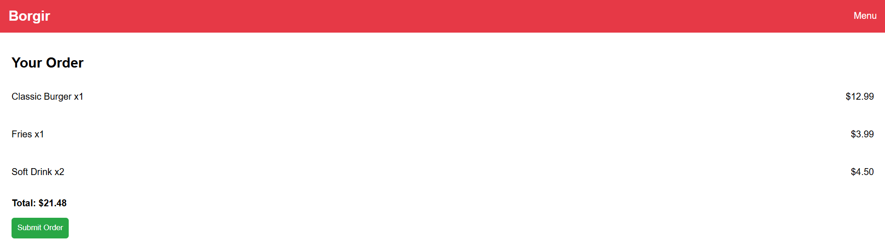

# SDA Project

## Overview
This project showcases two web pages (`index.html` and `cart.html`) hosted using GitHub Pages. The web pages display static content and images, making it a simple yet effective demonstration of basic web development skills.

**Live Demo**: [View the project here](https://h7mmxd.github.io/sda/)

---

## Features
- **Index Page**: Provides an introductory page for the project.
- **Cart Page**: Displays shopping cart details with static images.
- **Static Images**: Enhances the overall visual appeal of the pages.

---

### Screenshots
# Index Page


# Cart Page


---

# Database
This project does not utilize a database.

---

## How to Run
1. Clone the repository:
   ```bash
   git clone https://github.com/h7mmxd/sda.git
